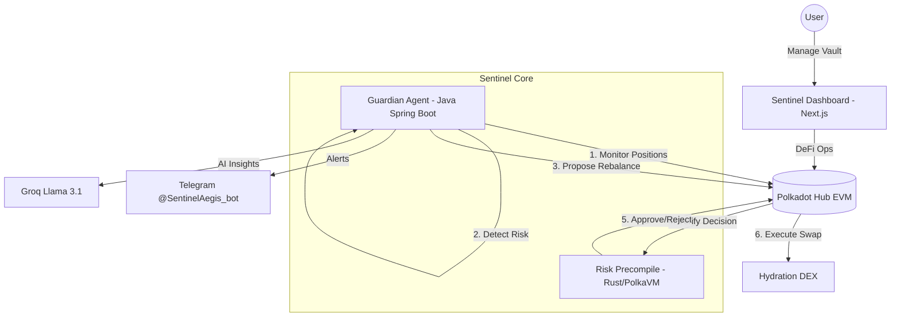

# 🛡️ Sentinel: The Agentic DeFi Guardian

Sentinel is a next-generation **Agentic DeFi Guardian** built for the Polkadot Hub ecosystem. It bridges the gap between trustless smart contracts and proactive, AI-driven risk management.

---

## 🏛️ Architecture Overview

Sentinel is designed as a modular, asynchronous system where each component has a distinct responsibility:

### High-Level System Flow

### Component Breakdown

1.  **Guardian Agent (Java)**: The "Proactive Eye". It polls the blockchain every 60 seconds, calculates volatility, and manages user alerts.
2.  **Risk Precompile (Rust/PolkaVM)**: The "Enforcer". This code runs on-chain. It ensures the Guardian Agent only triggers rebalances that are mathematically necessary and fair.
3.  **Sentinel Dashboard (Next.js)**: The "Command Center". A premium UI for users to mint sUSD, monitor their Health Factor, and chat with the AI.
4.  **SentinelVault (Solidity)**: The "Vault". Holds DOT collateral and manages sUSD debt. It is the bridge between the user and the DeFi ecosystem.

---

## 🔬 Technical Deep-Dive

### 1. The Autonomous Monitoring Loop (`Java_Agent`)
The Guardian Agent runs a continuous monitoring cycle:
- **Price Discovery**: Fetches DOT/USD prices via the **Pyth Oracle**.
- **Risk Assessment**: For every active vault, it calculates the **Health Factor (HF)**:
  `HF = (Collateral Value in USD) / (Debt in sUSD) * 100`
- **Dynamic Thresholding**: 
    - **Safe**: HF > 150%
    - **Warning**: 130% - 150% (Telegram Alert)
    - **Aegis Mode**: If volatility exceeds $0.50/hr, the agent raises the "Safe" target to 170%, providing a thicker safety buffer.

### 2. Trustless Rebalancing with PolkaVM (`pvm-risk-score`)
Sentinel solves the "Trust" problem in automated DeFi. Typically, a bot has "Guardian" permissions to rebalance or pause positions. To prevent abuse, Sentinel uses a **PolkaVM Precompile**:
- When the Agent calls `emergencyRebalance()`, the Vault contract forwards the parameters to the PolkaVM module.
- The Rust code validates:
    - Is the position actually below the floor?
    - Is the proposed sell amount enough to reach the target?
    - Is the agent trying to "over-liquidate" (sanity cap)?
- If verification fails, the transaction reverts on-chain. **Trust is removed from the bot and placed in the math.**

---

## 🛡️ Feature Spotlight: Aegis & AI

### The "Aegis" Volatility Shield
Imagine a shield that thickens as the storm gets stronger. Sentinel's **Aegis Mode** monitors market "waves" (short-term volatility). When the market is calm, it stays at a standard 150% safety target. When volatility strikes, Aegis automatically raises the safety target, prompting the bot to rebalance earlier or notify users to add collateral before a flash-crash occurs.

### AI Risk Reports (`/why`)
Users can interact with the Telegram bot to understand *why* they are at risk.
- **Command**: `/why`
- **Logic**: The Agent assembles a technical prompt containing live Pyth prices, volatility stats, and debt levels. 
- **Processing**: This is sent to **Groq (Llama 3.1)** to generate a human-readable, actionable risk assessment.
- **Analogy**: Sentinel isn't just a bot; it's a **Digital Financial Advisor** that watches your back 24/7.

---

## 🏗️ Environment & Deployment

### Java Agent
- **Runtime**: Java 17, Maven.
- **Key Vars**: `SENTINEL_PRIVATE_KEY` (Guardian wallet), `TELEGRAM_BOT_TOKEN`, `GROQ_API_KEY`.
- **Dockerfile**: Multi-stage build for easy deployment on Render/Docker.

### PolkaVM Module
- **Language**: Rust (`no_std`).
- **Target**: `riscv32-unknown-unknown-elf`.
- **Deployment**: Deployed via `pallet-revive` as an on-chain precompile.

### Next.js Dashboard
- **Framework**: Next.js 14 (App Router).
- **Web3**: Wagmi & TanStack Query optimized for Polkadot Hub.
- **Styling**: Premium Glassmorphism with Tailwind CSS.

---

## 🚀 Future Ideas
- **Cross-Chain Aegis**: Using XCM to protect assets across the entire Polkadot ecosystem.
- **DAO Protocol**: Community-governed risk parameters and volatility thresholds.
- **Multi-Asset Vaults**: Extending the Guardian's protection to KSM, GLMR, and more.
