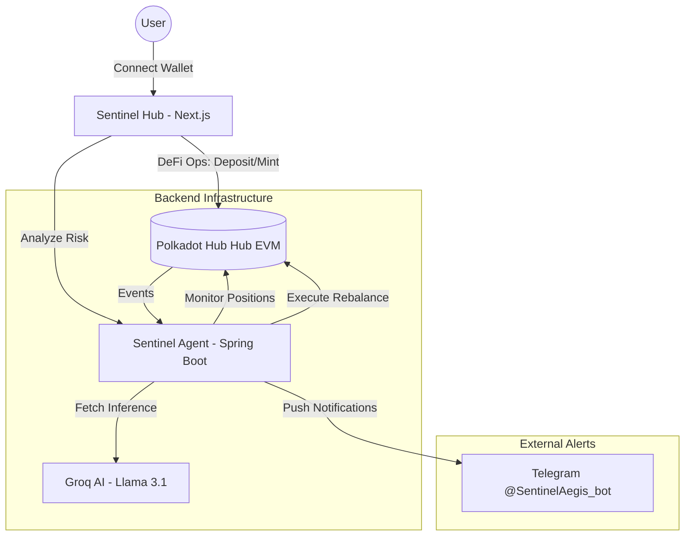

# 🛡️ Sentinel — Agentic DeFi Guardian

Sentinel is a next-generation **Agentic DeFi Guardian** built for the Polkadot Hub ecosystem. It combines a high-performance Java agent with a premium Next.js dashboard to provide real-time risk alerts via Telegram, AI-driven insights, and one-click vault operations.

> [!TIP]
> **Check out the [End-to-End Documentation](file:///home/abhay_device/Sentinel/DOCUMENTATION.md)** for a deep-dive into the architecture, PVM verification, and the Aegis volatility shield.

## 🚀 Live Access
- **Dashboard**: [sentinel-v2-gamma.vercel.app](https://sentinel-v2-gamma.vercel.app)
- **Bot Endpoint**: [sentineljavaagent.onrender.com](https://sentineljavaagent.onrender.com)

---

## 🏗️ Architecture

Sentinel is designed as a modular, asynchronous system that bridges highly responsive UI with proactive backend risk management.

### System Overview


### Technical Components

#### 1. **Sentinel Hub (Frontend)** — `sentinel-v2/`
- **Purpose**: User command center for vault management and risk oversight.
- **Key Modules**:
  - `TabVault`: Direct interaction with smart contracts for collateral management.
  - `TabAI`: Real-time chat interface that communicates with the Java Agent's LLM proxy.
  - `Wagmi/Chain Config`: Optimized for Polkadot Hub Hub Testnet with Talisman (EIP-6963) compatibility.

#### 2. **Sentinel Java Agent (Bot)** — `Java_Agent/`
- **Purpose**: Proactive "Guardian" that manages risk and handles complex AI data processing.
- **Workflow**:
  - **Monitoring Loop**: Polls user vault positions every 60s via Web3j.
  - **Auto-Rebalance**: If Health Factor drops below the safety threshold (e.g., 1.2), the agent triggers a rebalancing transaction using its stored Guardian private key.
  - **LLM Proxy**: Transforms raw on-chain data into technical English prompts for Groq, then serves the AI analysis back to the frontend to ensure low-latency, technical accuracy.
  - **Telegram Integration**: Uses the Telegram Bot API to push critical alerts directly to users.

#### 3. **Smart Contracts** — `src/` (Foundry)
- **Purpose**: Trustless execution layer for all financial value.
- **Contracts**:
  - `SentinelVault`: Manages DOT collateral and sUSD debt.
  - `sUSDToken`: EIP-20 stablecoin backed by collateral.
  - `Rebalancer`: Authorized contract that allows the Guardian Bot to adjust collateral levels.

---

## 🛠️ Local Development

### Prerequisites
- Node.js v18+
- Java 17
- Maven
- MetaMask or Talisman wallet

### Running the Frontend
```bash
cd sentinel-v2
npm install
npm run dev
```

### Running the Bot
```bash
cd Java_Agent
# Update .env with your keys
./start_bot.sh
```

---

## 🔐 Environment Variables

### Bot (`Java_Agent/.env`)
| Variable | Description |
|----------|-------------|
| `SENTINEL_PRIVATE_KEY` | Hex private key for the Guardian wallet |
| `TELEGRAM_BOT_TOKEN` | Token from @BotFather |
| `GROQ_API_KEY` | API Key for AI Risk Analyst |
| `SENTINEL_RPC_URL` | Polkadot Hub Hub Testnet RPC |

### Frontend (`sentinel-v2/.env.local`)
| Variable | Description |
|----------|-------------|
| `NEXT_PUBLIC_BOT_URL` | URL of the running Java Agent |

---

## 🚢 Deployment Guide

### Frontend (Vercel)
- Connect repository to Vercel.
- Set **Root Directory** to `sentinel-v2`.
- Deploy.

### Bot (Render)
- New Web Service.
- Set **Root Directory** to `Java_Agent`.
- Set **Runtime** to `Docker`.
- Add environment variables (see above).
- Render will use the included `Dockerfile` for a multi-stage build.

---

## 📄 License
MIT
